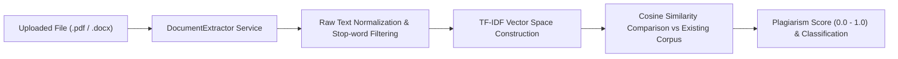

# RESEARCH-HUB — University Research Collaboration Platform

[](https://nodejs.org/)
[](https://react.dev/)
[](https://expressjs.com/)
[](https://www.mongodb.com/)
[](https://www.python.org/)
[](https://opensource.org/licenses/MIT)

---

## 📖 Table of Contents

1. [Project Overview](#-project-overview)
2. [Key Features](#-key-features)
3. [System Architecture](#-system-architecture)
4. [Technology Stack](#-technology-stack)
5. [Project Folder Structure](#-project-folder-structure)
6. [Frontend Details](#-frontend-details)
7. [Backend Details](#-backend-details)
8. [Database Schema & Models](#-database-schema--models)
9. [AI, NLP & Analytics Microservice](#-ai-nlp--analytics-microservice)
10. [Plagiarism Detection Engine](#-plagiarism-detection-engine)
11. [Authentication & Security](#-authentication--security)
12. [API Reference & Documentation](#-api-reference--documentation)
13. [Prerequisites](#-prerequisites)
14. [Installation & Setup](#-installation--setup)
15. [Environment Variables](#-environment-variables)
16. [Running the Application](#-running-the-application)
17. [Database Seeding & Demo Accounts](#-database-seeding--demo-accounts)
18. [Testing Suite](#-testing-suite)
19. [Production Deployment](#-production-deployment)
20. [UI Screenshots](#-ui-screenshots)
21. [Known Limitations](#-known-limitations)
22. [Future Enhancements](#-future-enhancements)
23. [Contributing](#-contributing)
24. [License](#-license)
25. [Support & Contact](#-support--contact)

---

## 🔬 Project Overview

**RESEARCH-HUB** is an enterprise-grade academic collaboration and research management platform designed for universities, academic institutions, and interdisciplinary research teams. It bridges the gap between students, researchers, faculty members, and professors by streamlining how research initiatives are proposed, discovered, staffed, verified, and audited.

The platform provides an end-to-end environment for:
- Publishing research proposals and projects with full document management.
- Matching researchers with relevant projects using bidirectional collaboration workflows (invitation vs. join requests).
- Automated document-level and metadata-level **plagiarism detection** (supporting PDF and DOCX text extraction via TF-IDF & Cosine Similarity).
- Formal **faculty verification** workflows that allow academic professors to review, endorse, and certify student research initiatives.
- Real-time updates and notification streams powered by **WebSockets (Socket.io)**.
- Advanced AI/NLP analytics for trending research topics, keyword extraction, and collaborator recommendations.

---

## ✨ Key Features

- **🎓 Comprehensive User Profiles & Academic Portfolios**:
  - Detailed researcher profiles featuring affiliations, department, designations (`Student`, `Researcher`, `Professor`, `Admin`, `Guest`), research interests, publication list with DOI/URLs, and external academic links (ORCID, Google Scholar, LinkedIn, personal website).
  - Public username system with search and profile discovery.

- **📁 Project Lifecycle & Asset Management**:
  - Complete project creation and editing with research areas, abstract, methodology, funding info, tags, and customizable collaborator role limits.
  - Multi-file attachment support with automatic MIME validation for PDF, DOCX, datasets, and images.
  - Granular privacy settings (`Public`, `Private`, `Restricted`) and collaboration availability toggles.

- **🤝 Bidirectional Collaboration Workflows**:
  - **Invite Mode**: Project owners discover researchers and send formal invitations with customizable proposed roles (e.g., *Frontend Developer*, *Data Analyst*, *Lead Researcher*, *Technical Writer*).
  - **Request Mode**: Researchers discover open projects and submit proposals to join the project team.
  - **Lifecycle Management**: Accept, decline/reject, cancel pending requests, revoke team members, or self-exit with mandatory justification notes.
  - Automatic synchronization of project team members upon acceptance, revocation, or exit.

- **🔍 Automated Document & Project Plagiarism Detection**:
  - Multi-format text extraction supporting `.pdf` (via `pdf-parse`) and `.docx` (via `mammoth`).
  - Text normalization, tokenization, and stop-word filtering using the `natural` NLP library.
  - TF-IDF vectorization and Cosine Similarity calculation against all existing platform documents.
  - Tiered similarity classification (`clear`, `low_similarity`, `moderate_similarity`, `high_similarity`) with match percentage reporting.

- **🏛️ Faculty Project Verification Portal**:
  - Direct submission of research projects to professors for academic verification.
  - Dedicated Faculty Portal for professors to review, approve with notes, or reject verification requests.
  - Verified projects display verified badges with auditing timestamps and professor credentials.

- **⚡ Real-Time Socket.io Notifications**:
  - Live websocket connections per user room (`user_{id}`) and project room (`project_{id}`).
  - Instant alerts for collaboration invitations, status updates, team member revocations/exits, professor verification reviews, and comments.

- **📊 AI/NLP Analytics & Recommendation Microservice (Python/Flask)**:
  - Python microservice integrating `scikit-learn`, `pandas`, and `nltk`.
  - Collaborator recommendation engine based on TF-IDF profile matching.
  - Real-time research topic trend analysis and automated keyword extraction.
  - Seamless fallback to JavaScript native NLP algorithms if the Python service is offline.

- **🛡️ Administrative Governance & Moderation**:
  - Dedicated Admin Portal with platform overview analytics (user growth, project metrics, collaboration ratios).
  - Complete user management with searchable tables, profile editing, role assignment, account deactivation, and multi-step confirmation deletions.

---

## 🏗️ System Architecture

```mermaid
flowchart TD
    subgraph Client ["Frontend Client (React 18)"]
        UI["React SPA (Port 3000)"]
        AuthCtx["AuthContext & State"]
        SocketClient["Socket.io Client"]
    end

    subgraph Server ["Backend API (Node.js / Express - Port 5000)"]
        API["Express Router (/api/*)"]
        AuthMW["Auth Middleware (JWT & RBAC)"]
        Controllers["API Controllers"]
        SocketServer["Socket.io WebSocket Server"]
        DocExtractor["Document Extractor (PDF/DOCX)"]
        PlagEngine["Plagiarism Engine (natural / TF-IDF)"]
    end

    subgraph Storage ["Database & File Storage"]
        MongoDB[("MongoDB (Port 27017)")]
        Uploads["Static File Store (/uploads)"]
    end

    subgraph Analytics ["Analytics Microservice (Python / Flask - Port 8000)"]
        FlaskAPI["Flask App (app.py)"]
        RecService["Recommendation Service"]
        TrendService["Trend Analysis Service"]
        NLPService["Keyword & Similarity Service"]
    end

    UI <-->|HTTP REST / Axios| API
    UI <-->|WebSockets (ws://)| SocketServer
    API --> AuthMW --> Controllers
    Controllers <--> MongoDB
    Controllers --> Uploads
    Controllers --> DocExtractor --> PlagEngine
    Controllers <-->|HTTP API (Optional)| FlaskAPI
    FlaskAPI --> RecService
    FlaskAPI --> TrendService
    FlaskAPI --> NLPService
```

---

## 💻 Technology Stack

### Frontend
| Technology | Version | Description |
|---|---|---|
| **React** | `18.2.0` | Frontend UI library with functional components & hooks |
| **React Router DOM** | `6.20.1` | Client-side routing with protected route guards and lazy loading |
| **Axios** | `1.6.2` | Promise-based HTTP client with interceptors for JWT Bearer headers |
| **Socket.io Client** | `4.8.1` | Real-time WebSocket connection for live notifications |
| **Chart.js / React-Chartjs-2** | `4.4.1 / 5.2.0` | Interactive charts for user dashboard and admin analytics |
| **React Toastify** | `9.1.3` | Non-blocking toast notification alerts |
| **Moment.js** | `2.29.4` | Human-readable timestamp parsing and date formatting |
| **Tailwind CSS / PostCSS** | `3.3.6 / 8.4.32`| Utility styling coupled with custom CSS design tokens |

### Backend API
| Technology | Version | Description |
|---|---|---|
| **Node.js** | `>=16.0.0` | JavaScript server runtime |
| **Express.js** | `4.18.2` | RESTful API framework |
| **Mongoose** | `8.0.0` | MongoDB ODM with schemas, validation, and virtuals |
| **Socket.io** | `4.8.1` | Real-time bidirectional event server |
| **JSONWebToken** | `9.0.2` | Stateless authentication tokens |
| **Bcryptjs** | `2.4.3` | Password hashing with 10 salt rounds |
| **Multer** | `2.0.2` | Multipart/form-data upload handling with file filters |
| **Helmet** | `7.1.0` | Security headers (CSP, frameguard, X-XSS-Protection) |
| **Express Rate Limit** | `7.1.5` | IP rate limiting to prevent brute-force attacks |
| **Express Mongo Sanitize** | `2.2.0` | Sanitizes user inputs against NoSQL injection attacks |
| **HPP** | `0.2.3` | HTTP Parameter Pollution defense |
| **Swagger UI / JSDoc** | `5.0.0 / 6.2.8`| Interactive OpenAPI 3.0 interactive documentation |

### NLP & Document Processing (Node.js)
| Package | Version | Purpose |
|---|---|---|
| **`natural`** | `^8.1.0` | Tokenization, TF-IDF calculation, and Cosine Similarity |
| **`pdf-parse`** | `^2.4.5` | Extracts raw text from `.pdf` documents |
| **`mammoth`** | `^1.11.0` | Extracts raw text from `.docx` documents |

### Analytics Microservice (Python)
| Technology | Version | Purpose |
|---|---|---|
| **Python** | `>=3.9` | Analytics service execution runtime |
| **Flask** | `3.0.0` | Lightweight microservice web framework |
| **Flask-CORS** | `4.0.0` | Cross-origin resource sharing handler |
| **PyMongo** | `4.6.0` | Native MongoDB driver for Python |
| **scikit-learn** | `>=1.4.0` | Machine learning TF-IDF vectorizer and Cosine distance |
| **NLTK** | `3.8.1` | Natural Language Toolkit for stop-word removal and text normalization |
| **Pandas / NumPy** | `>=2.1.0 / >=1.26.0`| High-performance data structures and numerical operations |
| **Gunicorn** | `21.2.0` | Production WSGI HTTP server |

### Testing & Quality Assurance
| Tool | Version | Purpose |
|---|---|---|
| **Jest** | `29.7.0` | Backend test runner and assertion framework |
| **Supertest** | `6.3.3` | HTTP endpoint integration testing |
| **`mongodb-memory-server`** | `^9.0.0` | In-memory ephemeral MongoDB instance for isolated testing |
| **React Testing Library** | `^14.0.0` | Frontend component unit testing |
| **Jest DOM** | `^6.0.0` | Custom DOM element matchers |

---

## 📂 Project Folder Structure

```
RESEARCH-HUB/
├── package.json                   # Root scripts (concurrent dev launcher)
├── start-dev.ps1                  # PowerShell parallel startup script
├── start-dev.bat                  # Windows batch parallel startup script
├── deploy-production.ps1          # Production deployment script (PowerShell)
├── deploy-production.sh           # Production deployment script (Bash)
│
├── FRONTEND/                      # React 18 Single Page Application
│   ├── package.json               # Client dependencies & scripts
│   ├── public/                    # Static assets & index.html
│   └── src/
│       ├── App.js                 # Route definitions & app shell
│       ├── index.js               # React DOM entrypoint
│       ├── components/            # Reusable UI components
│       │   ├── layout/            # Navbar, Footer
│       │   ├── routing/           # PrivateRoute wrapper
│       │   └── RevocationAlertBanner.js
│       ├── context/               # AuthContext.js
│       ├── pages/                 # 19 Feature & Landing Pages
│       │   ├── AdminPanel.js
│       │   ├── Collaborations.js
│       │   ├── CreateProject.js
│       │   ├── Dashboard.js
│       │   ├── EditProject.js
│       │   ├── Home.js
│       │   ├── Login.js
│       │   ├── Notifications.js
│       │   ├── PlagiarismChecker.js
│       │   ├── Profile.js
│       │   ├── ProjectDetails.js
│       │   ├── Projects.js
│       │   ├── Register.js
│       │   ├── SendCollaborationRequest.js
│       │   ├── Settings.js
│       │   ├── UploadDocument.js
│       │   └── VerificationRequests.js
│       ├── services/              # API Axios instance & Socket.io client
│       ├── styles/                # Design tokens & CSS systems
│       └── __tests__/             # Component & validation unit tests
│
├── server/                        # Node.js / Express Backend
│   ├── package.json               # Server dependencies & test scripts
│   ├── server.js                  # Main server entrypoint & Socket.io initialization
│   ├── .env.example               # Template environment configuration
│   ├── jest.config.js             # Jest test runner configuration
│   ├── config/                    # DB connection & Multer upload configuration
│   ├── controllers/               # Business logic controllers (7 modules)
│   ├── middleware/                # JWT Auth, RBAC, Validator, Error Handler
│   ├── models/                    # Mongoose schemas (8 models)
│   ├── routes/                    # Express REST route definitions (8 routers)
│   ├── services/                  # PlagiarismChecker & DocumentExtractor
│   ├── sockets/                   # WebSocket event listeners
│   ├── utils/                     # Database seeders, socket emitters, helpers
│   ├── uploads/                   # Stored user-uploaded files & attachments
│   └── __tests__/                 # Comprehensive 8-level test suite (Unit & Integration)
│
├── analytics/                     # Python / Flask AI/NLP Microservice
│   ├── app.py                     # Flask API entrypoint
│   ├── requirements.txt           # Python dependencies
│   ├── .env.example               # Microservice environment template
│   └── services/                  # Keyword, recommendation & trend services
│
├── docs/                          # Detailed architecture & deployment documentation
└── postman/                       # Postman API Collection (v2.1)
```

---

## 🎨 Frontend Details

The frontend is a modular Single Page Application built on **React 18** with a custom CSS token-driven design system (`NiceSchoolGlobal.css` and `GlobalDesignSystem.css`).

### Key Pages & Route Map

| Path | Component | Access | Description |
|---|---|---|---|
| `/` | `Home.js` | Public | Platform landing page; dynamic hero for authenticated users |
| `/login` | `Login.js` | Public | Authentication with email & password |
| `/register` | `Register.js` | Public | 2-step academic registration (account info + academic profile) |
| `/projects` | `Projects.js` | Public | Searchable research project catalog with filters and pagination |
| `/projects/:id` | `ProjectDetails.js` | Public / Auth | Full project documentation, team list, attachments, verification status, comments |
| `/projects/create` | `CreateProject.js` | Private | Project creation wizard with tags, requirements, and file uploads |
| `/projects/edit/:id` | `EditProject.js` | Private (Owner) | Modify project parameters, update status, and manage attachments |
| `/dashboard` | `Dashboard.js` | Private | Researcher overview, activity charts, quick stats, active initiatives |
| `/profile` | `Profile.js` | Private | Researcher portfolio, publication management, social/academic links |
| `/collaborations` | `Collaborations.js` | Private | Collaboration hub with tabs (`Received`, `Sent`, `All`) and action triggers |
| `/send-collaboration-request`| `SendCollaborationRequest.js`| Private | Custom collaboration proposal generator |
| `/verification-requests` | `VerificationRequests.js` | Private (Faculty) | Review and verify student projects (Professors only) |
| `/plagiarism` | `PlagiarismChecker.js` | Private | Document and text plagiarism analysis tool |
| `/notifications` | `Notifications.js` | Private | Real-time notification feed with read/unread state management |
| `/settings` | `Settings.js` | Private | Account preferences, password updates, email verification, privacy settings |
| `/admin` | `AdminPanel.js` | Private (Admin) | Platform analytics, user directory, role assignment, user moderation |

---

## ⚙️ Backend Details

The backend is built with **Node.js** and **Express.js**, following a clean Controller-Service-Repository architecture.

### API Router Architecture

```
/api
├── /auth            -> authRoutes.js           (Registration, Login, Profile, Search)
├── /users           -> userRoutes.js          (Admin User Management & RBAC)
├── /projects        -> projectRoutes.js       (Project CRUD, Attachments, Verification, Comments)
├── /collaborations  -> collaborationRoutes.js (Send, Accept, Reject, Revoke, Exit, Stats)
├── /notifications   -> notificationRoutes.js  (Fetch, Mark Read, Delete)
├── /analytics       -> analyticsRoutes.js     (Platform Metrics & Trends)
├── /events          -> eventRoutes.js         (Academic & Competition Events)
└── /plagiarism      -> documentPlagiarismRoutes.js (Direct Document Analysis)
```

---

## 🗄️ Database Schema & Models

The application utilizes **MongoDB** with strict Mongoose validation:

### 1. `User` Model
- **Credentials & Profile**: `firstName`, `lastName`, `email` (unique, lowercase), `username` (unique, sparse), `password` (hashed, excluded by default), `profilePicture`, `bio`, `phone`.
- **Academic Info**: `institution`, `department`, `designation` (`Student`, `Researcher`, `Professor`, `Admin`, `Guest`), `researchInterests` (array of strings).
- **Publications**: Array of subdocuments (`title`, `journal`, `year`, `doi`, `url`).
- **External Links**: `website`, `linkedIn`, `googleScholar`, `orcid`.
- **Role & Access**: `role` (`user`, `admin`), `isActive` (boolean), `isEmailVerified` (boolean).
- **Settings**: `privacySettings` (`profileVisibility`, `showEmail`, `showProjects`), `notificationPrefs`.

### 2. `Project` Model
- **Metadata**: `title`, `description`, `abstract`, `methodology`, `researchArea`, `keywords`, `tags`.
- **Ownership & Team**: `owner` (ObjectId ref User), `collaborators` (array of `{ user, role, joinedAt }`), `maxCollaborators`.
- **Status & Visibility**: `status` (`Planning`, `In Progress`, `Completed`, `On Hold`, `Cancelled`), `visibility` (`Public`, `Private`, `Restricted`), `isOpenForCollaboration`.
- **Attachments**: Array of `{ filename, url, fileSize, mimeType, uploadedBy, uploadedAt, plagiarism_checked, plagiarism_score, plagiarism_status, matched_document_id }`.
- **Faculty Verification**: `is_verified`, `verified_by_professor_id`, `verified_at`.
- **Plagiarism Flags**: `plagiarism_flag`, `plagiarism_score`, `matched_project_id`, `plagiarism_checked_at`.

### 3. `Collaboration` Model
- **Parties**: `sender` (ObjectId ref User), `receiver` (ObjectId ref User), `project` (ObjectId ref Project).
- **Proposal**: `message`, `proposedRole` (string, e.g. "Data Analyst"), `collaborationType` (`invite` vs `request`).
- **Status**: `status` (`Pending`, `Accepted`, `Rejected`, `Cancelled`, `Revoked`, `Exited`).
- **Response**: `response` (`message`, `respondedAt`), `expiresAt` (automatic 30-day TTL for pending requests).

### 4. `Notification` Model
- `recipient`, `type` (`PROJECT_INVITE`, `COLLABORATION_REQUEST`, `COLLABORATION_ACCEPTED`, `COLLABORATION_REJECTED`, `COLLABORATION_REVOKED`, `COLLABORATION_EXITED`, `PROJECT_VERIFIED`, etc.), `title`, `message`, `link`, `isRead`, `priority` (`normal`, `high`, `urgent`).

### 5. `VerificationRequest` Model
- `project`, `requestedBy`, `professor`, `status` (`PENDING`, `APPROVED`, `REJECTED`), `message`, `notes`, `reviewedAt`.

---

## 🤖 AI, NLP & Analytics Microservice

The platform includes a dedicated **Python Flask** microservice (`/analytics`) providing NLP and machine learning capabilities.

### Analytics Endpoints

| Method | Endpoint | Request Body | Description |
|---|---|---|---|
| `GET` | `/health` | None | Returns service health and version |
| `POST` | `/recommendations` | `{ "userId": "...", "researchInterests": [...], "projects": [...] }` | Generates recommended collaborators using TF-IDF & Cosine Similarity |
| `POST` | `/trends` | `{ "projects": [...] }` | Computes trending research topics via keyword frequency analysis |
| `POST` | `/keywords` | `{ "text": "...", "projectId": "..." }` | Extracts high-value keywords using TF-IDF and noun-phrase heuristics |
| `POST` | `/similarity` | `{ "text1": "...", "text2": "..." }` | Computes exact text similarity percentage between two inputs |

> **Resilient Fallback**: If the Python microservice is not running, the Node.js backend automatically falls back to native JavaScript NLP algorithms implemented via the `natural` package.

---

## 🔎 Plagiarism Detection Engine

The built-in plagiarism detection engine ensures academic integrity:



### Classification Thresholds
- **Clear (`< 15%`)**: Original work with standard academic citations.
- **Low Similarity (`15% - 30%`)**: Minor common phrasing or shared bibliography.
- **Moderate Similarity (`30% - 50%`)**: Substantial overlap; flagged for researcher review.
- **High Similarity (`> 50%`)**: Heavy textual duplication; automatically flagged on project profile.

---

## 🔒 Authentication & Security

- **Stateless JWT**: Secure tokens transmitted in `Authorization: Bearer <token>` headers.
- **Bcrypt Hashing**: Passwords stored with cryptographic salt rounds.
- **Privilege Escalation Prevention**: User update endpoints use strict field whitelisting (`userRoutes.js`). Users cannot self-modify roles or designations.
- **NoSQL Injection Defense**: `express-mongo-sanitize` strips operator keys (`$gt`, `$where`), and login controllers enforce strict primitive type checking.
- **HTTP Parameter Pollution (HPP)**: Sanitizes repeated query string parameters.
- **Stored XSS Prevention**: Uploaded attachments are served with `Content-Disposition: attachment` to prevent arbitrary in-browser script execution.
- **Rate Limiting**: Configurable request limits per IP window on all `/api/` endpoints.

---

## 📚 API Reference & Documentation

Interactive **OpenAPI 3.0 (Swagger)** documentation is embedded in the server:

- **Swagger UI**: `http://localhost:5000/api-docs`
- **Health Check**: `http://localhost:5000/health`
- **Postman Collection**: Available at `postman/RESEARCH-HUB.postman_collection.json`

### Core API Sample Endpoints

#### Authentication (`/api/auth`)
- `POST /api/auth/register` — Create a new researcher account
- `POST /api/auth/login` — Authenticate and receive JWT token
- `GET /api/auth/me` — Get current authenticated user profile
- `PUT /api/auth/updateprofile` — Update allowed researcher profile fields
- `PUT /api/auth/updatepassword` — Change account password
- `GET /api/auth/search-users?q={query}` — Search researchers by name, username, or email

#### Projects (`/api/projects`)
- `GET /api/projects` — List projects with search, filter, and pagination
- `POST /api/projects` — Create a new project (Authenticated)
- `GET /api/projects/:id` — Retrieve single project details
- `PUT /api/projects/:id` — Update project parameters (Owner only)
- `DELETE /api/projects/:id` — Delete a project (Owner only)
- `POST /api/projects/:id/attachments` — Upload PDF/DOCX file to project
- `POST /api/projects/:id/check-metadata-plagiarism` — Run plagiarism check on project metadata
- `POST /api/projects/:id/verification-request` — Submit project to a professor for verification

#### Collaborations (`/api/collaborations`)
- `GET /api/collaborations` — List current user's collaborations
- `GET /api/collaborations/stats` — Retrieve collaboration metrics breakdown
- `POST /api/collaborations` — Send a collaboration request or invitation
- `PUT /api/collaborations/:id/accept` — Accept collaboration and join project team
- `PUT /api/collaborations/:id/reject` — Decline collaboration request
- `PUT /api/collaborations/:id/revoke` — Revoke team member from project (Owner only)
- `PUT /api/collaborations/:id/exit` — Leave project collaboration with reason note
- `DELETE /api/collaborations/:id` — Cancel a pending collaboration request

#### Admin (`/api/users`)
- `GET /api/users` — Paginated user directory (Admin only)
- `POST /api/users` — Create user administratively (Admin only)
- `PUT /api/users/:id` — Update user details safely (Admin only)
- `DELETE /api/users/:id` — Delete user account (Admin only)

---

## 📋 Prerequisites

Ensure the following runtimes and services are installed on your machine:

1. **Node.js**: Version `16.0.0` or higher ([Download Node.js](https://nodejs.org/))
2. **npm**: Version `8.0.0` or higher (bundled with Node.js)
3. **MongoDB**: Local MongoDB community server running on port `27017` or a MongoDB Atlas URI ([Download MongoDB](https://www.mongodb.com/try/download/community))
4. **Python (Optional for Analytics)**: Version `3.9` or higher ([Download Python](https://www.python.org/))

---

## 🚀 Installation & Setup

### 1. Clone the Repository
```bash
git clone https://github.com/your-username/RESEARCH-HUB.git
cd RESEARCH-HUB
```

### 2. Install Dependencies

#### Install Root Launcher Dependencies
```bash
npm install
```

#### Install Backend Dependencies
```bash
cd server
npm install
cd ..
```

#### Install Frontend Dependencies
```bash
cd FRONTEND
npm install
cd ..
```

#### (Optional) Install Python Analytics Dependencies
```bash
cd analytics
python -m venv venv

# Windows:
venv\Scripts\activate

# macOS / Linux:
source venv/bin/activate

pip install -r requirements.txt
cd ..
```

---

## 🔐 Environment Variables

Create `.env` files in `server/` and `analytics/` based on their respective `.env.example` templates.

### Backend (`server/.env`)
```env
# Server Configuration
PORT=5000
NODE_ENV=development

# Database Configuration
MONGO_URI=mongodb://127.0.0.1:27017/research-hub

# JWT Authentication
JWT_SECRET=your_super_secret_jwt_key_change_in_production_32chars_min
JWT_EXPIRE=7d

# Python Analytics Service (Optional)
ANALYTICS_API_URL=http://localhost:8000

# CORS Allowed Origins (Comma-separated)
CORS_ORIGINS=http://localhost:3000,http://localhost:3001

# Rate Limiting
RATE_LIMIT_WINDOW_MS=900000
RATE_LIMIT_MAX_REQUESTS=1000
```

### Analytics Service (`analytics/.env` - Optional)
```env
FLASK_APP=app.py
FLASK_ENV=development
PORT=8000
MONGO_URI=mongodb://127.0.0.1:27017/research-hub
CACHE_EXPIRY=86400
MIN_SIMILARITY_SCORE=0.3
MAX_RECOMMENDATIONS=10
```

---

## ▶️ Running the Application

### Option 1: Quick Launch (All-in-One)

#### Windows (PowerShell)
```powershell
.\start-dev.ps1
```

#### Windows (Command Prompt)
```cmd
start-dev.bat
```

#### Universal (NPM Concurrently)
```bash
npm run dev
```

### Option 2: Running Services Individually

#### Terminal 1 — Backend (Port 5000)
```bash
cd server
npm run dev
```

#### Terminal 2 — Frontend (Port 3000)
```bash
cd FRONTEND
npm start
```

#### Terminal 3 — Python Analytics (Port 8000 - Optional)
```bash
cd analytics
# Activate virtual environment first
venv\Scripts\activate     # Windows
# source venv/bin/activate # Linux/Mac
python app.py
```

Open your browser and navigate to **`http://localhost:3000`**.

---

## 🧪 Database Seeding & Demo Accounts

To populate your database with demo users, research projects, comments, and collaborations:

```bash
cd server
npm run seed
```

### Demo Accounts Created by Seeder

| Email | Password | Role | Designation | Institution |
|---|---|---|---|---|
| `alice@university.edu` | `password123` | **admin** | Professor | Stanford University |
| `bob@university.edu` | `password123` | user | Associate Professor | MIT |
| `carol@university.edu` | `password123` | user | PhD Student | Harvard University |
| `david@university.edu` | `password123` | user | Researcher | UC Berkeley |

---

## 🧪 Testing Suite

RESEARCH-HUB includes a comprehensive **8-level automated test suite** (12 test files, 239+ tests) covering Unit, Integration, Functional, Security, System, UI/UX, Regression, and UAT levels.

### Running Backend Tests (Jest + Supertest)
Backend tests execute against an in-memory MongoDB server (`mongodb-memory-server`) with zero impact on your local database:

```bash
cd server
npm test
```

To run a specific test suite:
```bash
npx jest __tests__/integration/collaborations.test.js
npx jest __tests__/integration/security.test.js
npx jest __tests__/unit/models/user.model.test.js
```

### Running Frontend Tests (React Testing Library)
```bash
cd FRONTEND
npm test -- --watchAll=false
```

---

## 🚢 Production Deployment

The project includes ready-to-run production deployment scripts:

### Build Frontend
```bash
cd FRONTEND
npm run build
```

### Run Deployment Scripts
- **Windows**: `.\deploy-production.ps1`
- **Linux/Mac**: `chmod +x deploy-production.sh && ./deploy-production.sh`

### Cloud Hosting Recommendations
- **Frontend SPA**: Vercel, Netlify, or AWS S3 + CloudFront
- **Backend API**: Render, Railway, AWS ECS, or DigitalOcean Droplet
- **Database**: MongoDB Atlas (Dedicated or Shared Cluster)
- **Analytics Service**: Railway or AWS Lambda / App Runner

For detailed production configuration, refer to [docs/PRODUCTION_DEPLOYMENT.md](./docs/PRODUCTION_DEPLOYMENT.md).

---

## 📸 UI Screenshots

> *Placeholder: Add application screenshots in the `/audit_screenshots` directory.*

| Home & Research Hero | Admin User Management |
|:---:|:---:|
|  |  |

| Project Details & Documents | Collaboration Hub |
|:---:|:---:|
|  |  |

---

## ⚠️ Known Limitations

1. **Local File Storage**: Uploaded attachments are stored in the local file system (`server/uploads/`). In multi-instance production environments, object storage (e.g., AWS S3, Google Cloud Storage) should be configured.
2. **Email Dispatching**: Email verification and password resets currently log dispatch events to the console; integration with an SMTP provider (e.g., SendGrid, AWS SES) is recommended for production.
3. **Large File Processing**: In-memory plagiarism extraction for PDF files is optimized for documents under 10MB.

---

## 🔮 Future Enhancements

- [ ] Cloud object storage integration (AWS S3 / Azure Blob) for file attachments.
- [ ] SMTP email transport integration for automated verification emails.
- [ ] Direct LaTeX / Overleaf project synchronization.
- [ ] Multi-institution federated single sign-on (SSO / SAML / Shibboleth).
- [ ] Citation graph visualization and co-authorship network explorer.
- [ ] Automated DOI generation for published research deliverables.

---

## 🤝 Contributing

Contributions are welcome! Please follow these steps:

1. Fork the repository.
2. Create a feature branch (`git checkout -b feature/AmazingFeature`).
3. Commit your changes (`git commit -m 'Add AmazingFeature'`).
4. Push to the branch (`git push origin feature/AmazingFeature`).
5. Open a Pull Request.

---

## 📄 License

This project is open source and available under the [MIT License](LICENSE).

---

## 📬 Support & Contact

- **API Documentation**: [http://localhost:5000/api-docs](http://localhost:5000/api-docs)
- **Project Issues**: Submit bug reports or feature requests via GitHub Issues.
- **Support Email**: `support@research-hub.edu`
